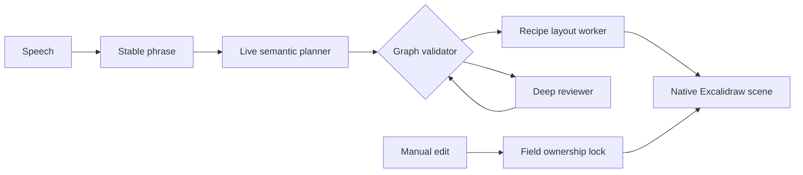

# Sprig

**A presentation-ready diagram that develops while you speak.**

Sprig is a local-first meeting copilot for designers and product teams. It listens to a natural explanation, turns stable phrases into an editable diagram, and quietly reviews its own interpretation without interrupting the speaker. One conversation can become several connected scenes on the same infinite canvas.

[Try the interactive playground](https://www.clarru.com/playground/sprig) · [Read the case study](https://www.clarru.com/sprig) · [Explore the architecture](docs/canvas/ARCHITECTURE.md)

## What changes in v0.5

Sprig now stores meaning before pixels. Its versioned semantic document separates the model's interpretation from Excalidraw's native rendering, so the live pass can move quickly while a deeper review repairs structure in the background.

- **Several scenes, one conversation.** Story, Flow, System, Hierarchy, and Comparison each keep their own graph, notes, transcript evidence, layout, and presentation frame.
- **Fast first pass, careful second pass.** A low-latency planner adds useful structure from stable phrases; an asynchronous reviewer repairs only the fields Sprig owns.
- **Manual work stays authoritative.** Moving, resizing, relabeling, restyling, or reconnecting an object protects that field from later AI changes.
- **Diagram rules are explicit.** Decisions are diamonds with labeled branches, retries return to real steps, terminals require spoken evidence, and unsupported inventions fail validation.
- **Deterministic layout.** ELK runs in a worker, routes orthogonal connectors around content, packs scenes without overlap, and produces no geometry change when meaning is unchanged.
- **Native Excalidraw editing.** Selection, text editing, bindings, custom color, roughness, rotation, resizing, undo, and redo remain native.

Story and Flow are the first production recipes. System, Hierarchy, and Comparison share the same contracts and remain experimental while their evaluation suites mature.

## How it works



The live planner emits semantic operations such as `openScene`, `upsertNode`, `setPath`, and `setRetry`. It does not choose coordinates, colors, or Excalidraw elements. Sprig validates those operations, lays out the affected scene, and reconciles the result with native objects. The [semantic scene engine guide](docs/canvas/SEMANTIC-SCENE-ENGINE.md) describes the contracts and migration model in detail.

## Visual language

The canvas stays white with a `#eeeeee` dot grid. Black ink, bold local type, filled-tip arrows, and crisp shadows make the diagram legible while it is still moving. Meaning is encoded consistently:

| Meaning | Shape and treatment |
| --- | --- |
| Explicit start or successful end | Lime terminal |
| Screen or action | Yellow rectangle |
| Actual condition | Pink diamond |
| Failure or warning | Orange `#fc702c` |
| Supporting context | White note |
| Tentative interpretation | Dashed outline |

The same grammar applies to generated and manually created objects, including empty shapes before text is entered.

## Run locally

Use Node.js 22.12 or newer and npm.

```sh
npm install
npm run dev
```

Open [http://127.0.0.1:5191](http://127.0.0.1:5191). The authored scenarios work without an API key.

For live listening, copy the local environment template and add your OpenAI API key:

```sh
cp apps/canvas/.env.example apps/canvas/.env
```

The key remains on the loopback server. Do not expose it through a `VITE_` variable. Audio is streamed for transcription and is never persisted. Board data, transcript text, notes, and semantic evidence stay in the browser's IndexedDB. Standard board exports omit transcript text unless the user explicitly includes it.

## Use the React package

The portable package exports the editor, UI surfaces, scenario player, document types, operations, projection, recipe registry, and local agent interface.

```tsx
import { CanvasEditor, ScenarioPlayer } from '@clarru/sprig'
import '@clarru/sprig/styles.css'

export function Demo() {
  return <ScenarioPlayer initialScenario="semantic-scenes" />
}
```

The package currently ships as a pinned tarball in [GitHub Releases](https://github.com/Clarru/sprig/releases). See the [embedding guide](packages/canvas/README.md) for exports and integration details.

## Local agent API

The optional local API lets another tool operate the same board through semantic actions without another interpretation request. It supports discovery, snapshots, atomic mutations, revision checks, undoable transactions, and compatibility translation for v1 actions. The service binds to loopback and requires a short-lived capability token. Read the [agent API reference](docs/canvas/AGENT-API.md) before integrating it.

## Verify changes

```sh
npm test
npm run build
npm run test:canvas:browser
npm run eval:layout
npm run eval:semantic
```

The test suite covers migration, operation validity, ownership locks, projection stability, native editing consistency, scene interaction, and diagram routing. Model evaluation fixtures are anonymized structural equivalents rather than private transcripts. Current measurements and their limits are recorded in [evaluation results](docs/canvas/evals/RESULTS.md).

Private rehearsals use the [voice rehearsal harness](docs/canvas/REHEARSALS.md). Scripts, recordings, environment values, build output, and visual review artifacts are excluded from the repository.

## Repository map

| Path | Purpose |
| --- | --- |
| `packages/canvas` | Portable React editor, semantic engine, native renderer, and tests |
| `apps/canvas` | Standalone local app, listening server, evaluation tools, and diagram lab |
| `docs/canvas` | Product contracts, architecture, validation, release, and evaluation notes |

## Project status

Sprig is an experimental open-source product and its public API can still change between minor releases. The v2 document is versioned, existing v1 boards migrate with a local backup, and new saves and exports use v2.

## License

Original code is released under the [MIT License](LICENSE). Preserve the [third-party notices](packages/canvas/THIRD_PARTY_NOTICES.md), including the vendored Bloub license and pinned upstream revision.
